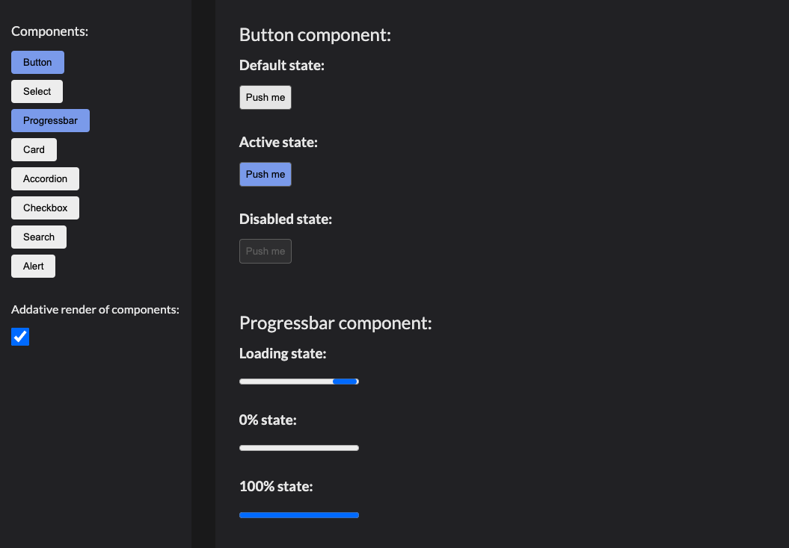

# Components Viewer

## Project Description

This project is part of an assignment from Høyskolen Kristiania, centered on designing an interface to showcase <b>eight distinct UI components</b> and their various states.

Published website: [https://sbraende-components.netlify.app/](https://sbraende-components.netlify.app/)

## Preview

## Features

- <b>Vanilla HTML, CSS, and JavaScript.</b>
- <b>Responsive Design:</b> Optimized for all screen sizes.
- <b>Component States:</b> Displays each component in multiple states, including default, hover, active, and disabled.
- <b>Toggle View:</b> Switch between additive and solo rendering modes for flexibility.
- <b>Minimal and Modern Design.</b>

## References:

- Components inspiration:

  - [Vy's Design System](https://spor.vy.no/components/)
  - [Material Design Components](https://m3.material.io/components)

- Design inspiration:

  [Sascha Eggenberger on Dribbble](https://dribbble.com/shots/10783694-Gin-FutureUI-Form-Display-Darkmode)

- Icons:

  [iconoir](https://iconoir.com/)
